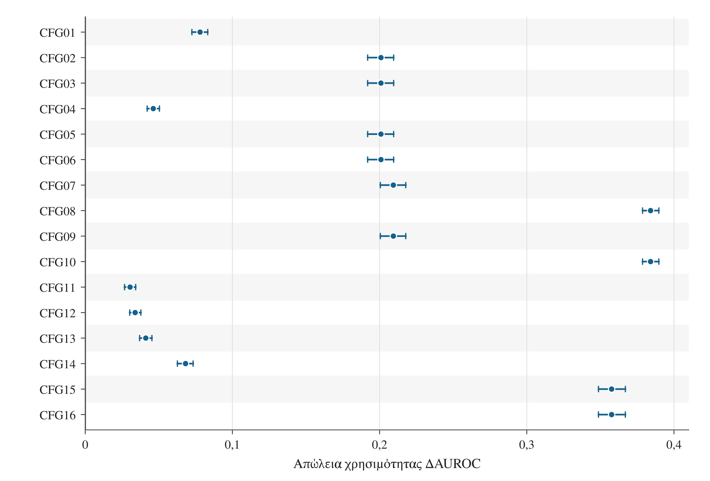
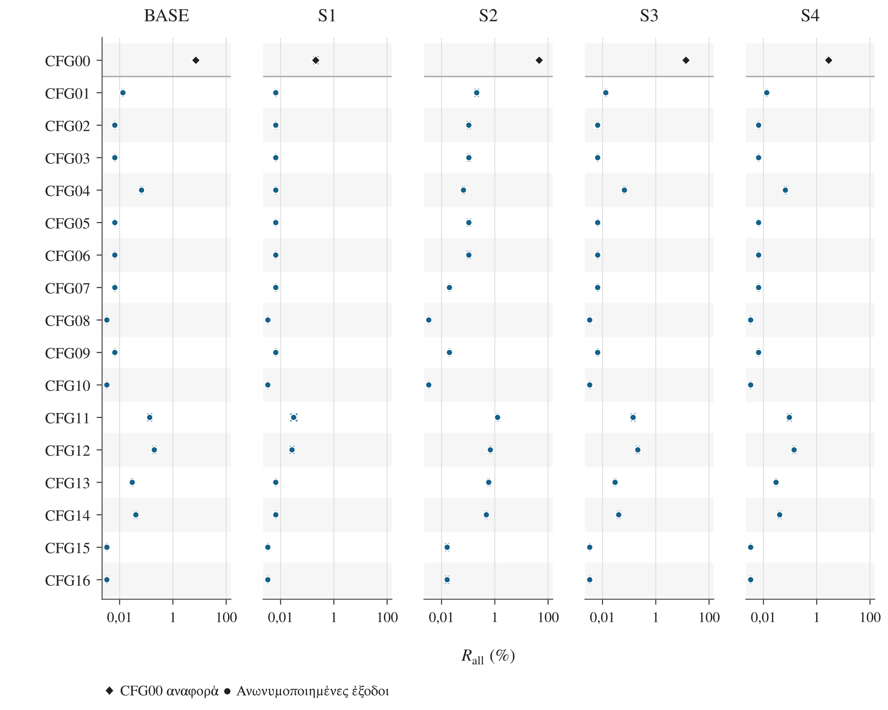
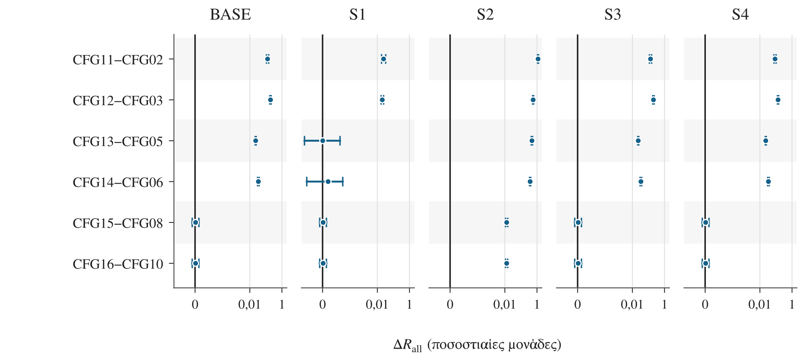
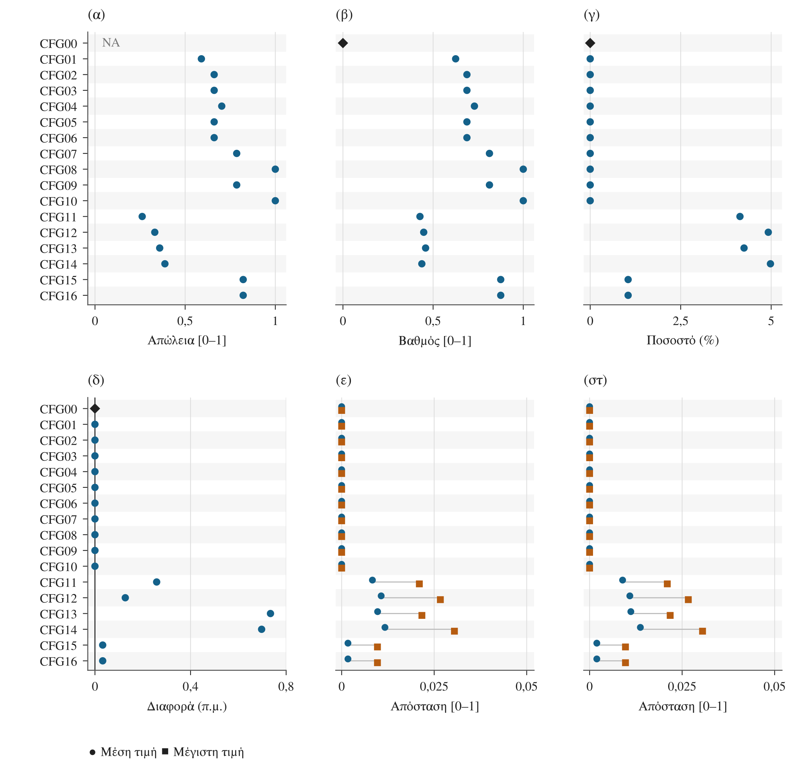
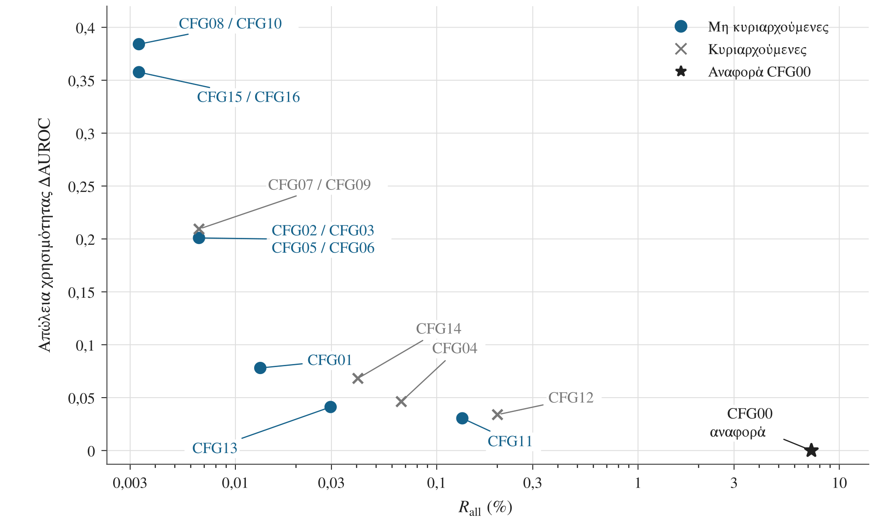

# Σχήματα και δεδομένα απεικόνισης

Τα πέντε σχήματα των §§5.2–5.4 παρέχονται σε PNG, SVG και PDF. Οι σημειώσεις εξηγούν τις μονάδες και τα όρια ερμηνείας.

## Αντιστοίχιση δεδομένων

Το [FIGURE_DATA.json](FIGURE_DATA.json) περιέχει τα δεδομένα απεικόνισης με κλειδιά F01–F05. Τα σχετικά συγκεντρωτικά αποτελέσματα είναι:

| Σχήμα | Κλειδί JSON | Σχετικά συγκεντρωτικά δεδομένα |
|---|---|---|
| 5.1 | F03 | [paired_delta_auroc.csv](../results/csv/paired_delta_auroc.csv) |
| 5.2 | F02 | [risk_points_and_controls.csv](../results/csv/risk_points_and_controls.csv), [risk_intervals.csv](../results/csv/risk_intervals.csv) |
| 5.3 | F04 | [risk_intervals.csv](../results/csv/risk_intervals.csv) |
| 5.4 | F05 | [structural.csv](../results/csv/structural.csv), [tvd.csv](../results/csv/tvd.csv) |
| 5.5 | F01 | [risk_points_and_controls.csv](../results/csv/risk_points_and_controls.csv), [paired_delta_auroc.csv](../results/csv/paired_delta_auroc.csv) |

## Σχήμα 5.1 Απώλεια προγνωστικής χρησιμότητας και ζευγαρωμένα διαστήματα 95%

[PNG](figure_5_1.png) | [SVG](figure_5_1.svg) | [PDF](figure_5_1.pdf)

Η ΔAUROC ισούται με AUROC(CFG00) − AUROC(ανωνυμοποιημένης εξόδου). Θετική τιμή δηλώνει απώλεια διακριτικής ικανότητας. Τα διαστήματα προκύπτουν από κοινή στρωματοποιημένη επαναδειγματοληψία του συνόλου ελέγχου, χωριστά ανά εισοδηματική κατηγορία, με σταθερά μοντέλα και διαχωρισμό δεδομένων. Δεν περιλαμβάνουν επανεκπαίδευση ή ταυτόχρονη κάλυψη όλων των συγκρίσεων. Τα άκρα τους δεν προκύπτουν με αφαίρεση των άκρων χωριστών διαστημάτων AUROC.

## Σχήμα 5.2 Κίνδυνος σύνδεσης στα πέντε σενάρια και διαστήματα σταθερότητας 95%

[PNG](figure_5_2.png) | [SVG](figure_5_2.svg) | [PDF](figure_5_2.pdf)

Παρουσιάζεται η Rall για 85 συνδυασμούς διαμόρφωσης και σεναρίου: 16 ανωνυμοποιημένες έξοδοι και CFG00 στα BASE και S1–S4. Η κοινή λογαριθμική κλίμακα εκφράζει τον κίνδυνο σε ποσοστό. Τα διαστήματα βασίζονται στην επαναδειγματοληψία των 1.744 αρχικών συστάδων και στις ήδη πραγματοποιηθείσες επιθέσεις. Δεν περιλαμβάνουν νέα επιλογή στόχων ή παραγωγή σφάλματος ηλικίας και δεν παρέχουν ταυτόχρονη κάλυψη. Διάστημα μηδενικού εύρους εμφανίζεται ως σημείο. Οι 85 συνδυασμοί δεν αποτελούν ανεξάρτητες παρατηρήσεις.

## Σχήμα 5.3 Προκαθορισμένες συγκρίσεις καταστολής και διαστήματα σταθερότητας 95%

[PNG](figure_5_3.png) | [SVG](figure_5_3.svg) | [PDF](figure_5_3.pdf)

Παρουσιάζονται έξι ζευγαρωμένες διαφορές Rall ανά σενάριο. Από τον κίνδυνο της διαμόρφωσης που επιτρέπει καταστολή έως 5% αφαιρείται ο κίνδυνος της αντίστοιχης διαμόρφωσης χωρίς καταστολή. Οι διαφορές εκφράζονται σε ποσοστιαίες μονάδες. Η συμμετρική λογαριθμική κλίμακα έχει γραμμική περιοχή |ΔRall| ≤ 0,00005 ποσοστιαίες μονάδες. Αν το διάστημα περιλαμβάνει το μηδέν, δεν τεκμηριώνεται διαφορά με σταθερό πρόσημο. Μαζί με το όριο καταστολής μπορεί να αλλάζει η γενίκευση, οπότε δεν απομονώνεται η επίδραση της αφαίρεσης εγγραφών. Δεν έχουν υπολογιστεί διαστήματα διαφορών μεταξύ σεναρίων.

## Σχήμα 5.4 Γενίκευση, καταστολή και μεταβολές κατανομών

[PNG](figure_5_4.png) | [SVG](figure_5_4.svg) | [PDF](figure_5_4.pdf)

Παρουσιάζονται η ARX Loss, ο βαθμός γενίκευσης G, το ποσοστό καταστολής S, η μεταβολή της αναλογίας >50K σε ποσοστιαίες μονάδες και δύο οικογένειες αποστάσεων ολικής μεταβολής (TVD): ανά οιονεί αναγνωριστικό και ανά κοινή κατανομή οιονεί αναγνωριστικού–εισοδήματος. Οι κύκλοι δίνουν τον απλό μέσο όρο και τα τετράγωνα τη μέγιστη τιμή των οκτώ αποστάσεων κάθε οικογένειας. Η μικρή κατακόρυφη μετατόπιση διαχωρίζει σημεία που συμπίπτουν.

Οι TVD συγκρίνουν την έξοδο Rc με το Tc(D), δηλαδή όλες τις αρχικές εγγραφές με την ίδια γενίκευση, χωρίς καταστολή. Μηδενική TVD σημαίνει ίδιες κατανομές σε αυτή τη σύγκριση, όχι μηδενική συνολική απώλεια πληροφορίας. Η ARX Loss της CFG00 δεν είναι διαθέσιμη (`NA`). Τα G και S παραμένουν χωριστές μετρήσεις. Θετική μεταβολή της αναλογίας >50K δηλώνει μεγαλύτερη εκπροσώπηση της κατηγορίας μετά την καταστολή, χωρίς να συνεπάγεται βελτίωση.

## Σχήμα 5.5 Κίνδυνος σύνδεσης και απώλεια χρησιμότητας στο βασικό σενάριο (BASE)

[PNG](figure_5_5.png) | [SVG](figure_5_5.svg) | [PDF](figure_5_5.pdf)

Συγκρίνονται η Rall και η ΔAUROC των 16 ανωνυμοποιημένων εξόδων. Η CFG00 εμφανίζεται μόνο ως αναφορά. Μικρότερες τιμές και στους δύο άξονες είναι προτιμότερες. Στο μέτωπο Pareto αντιστοιχούν 11 μη κυριαρχούμενες διαμορφώσεις, σε 6 διαφορετικά σημεία. Οι κωδικοί που συμπίπτουν αναγράφονται μαζί. Η διαφορά κινδύνου μεταξύ CFG08/10 και CFG15/16 είναι 0,000001597396 ποσοστιαίες μονάδες και δεν διακρίνεται στη συγκεκριμένη κλίμακα. Ο οριζόντιος άξονας είναι λογαριθμικός και εκφράζει τον κίνδυνο σε ποσοστό. Το μέτωπο βασίζεται σε σημειακές εκτιμήσεις και δεν τεκμηριώνει στατιστική υπεροχή.
